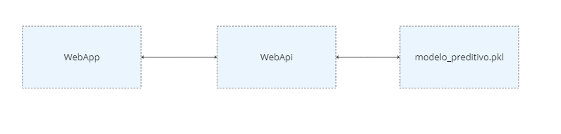

# AnalisadorVinhoTinto

## Introdução
Aplicação com o objetivo de fornecer previsões sobre qualidade de vinho com base nos atributos Acidez Fixa, Acidez Volátil, Cloreto, Dióxido de Enxofre, Sulfatos e Álcool.

As previsões são feitas utilizando um modelo de inteligência artificial treinado com os dados presentes no dataset disponível no link a seguir: https://www.kaggle.com/datasets/uciml/red-wine-quality-cortez-et-al-2009/data

## Descrição técnica
O analisador de vinho é composto por três grandes componentes:
- WebApp: Front-end da aplicação
- WebApi: Api que recebe requisições do front e retorna o resultado da previsão do vinho
- Modelo preditivo: Modelo de machine learning que é utilizado pela WebApi para realizar as previsões de qualidade vinhos
  
A imagem abaixo da topologia da aplicação ilustra a integração entre estes componentes

### WebApp:
#### HTML
- Container Principal: Um container Bootstrap que centraliza o conteúdo na página.
- Formulário de Predição (wineQualityForm): Um formulário HTML com campos de entrada para as propriedades do vinho, incluindo Acidez Fixa, Acidez Volátil, Cloretos, Dióxido de Enxofre Total, Sulfatos e Álcool.
- Resultado da Predição (wineQualityResult): Uma div para exibir o resultado da predição de qualidade do vinho.

#### CSS
- Estilo Geral: O estilo da página segue um tema rústico com cores e fontes que remetem a uma estética de vinícola.
- Estilo de Formulário e Botões: Os campos do formulário e botões são estilizados para se alinhar com o tema geral.
- Responsividade: A página é responsiva e se adapta a diferentes tamanhos de tela.

#### JavaScript e jQuery
- Validação de Entrada: Scripts JavaScript validam os dados inseridos nos campos do formulário, exibindo um aviso se os valores estiverem fora dos limites aceitáveis.
- Requisições AJAX: Ao submeter o formulário, uma requisição AJAX é enviada para a API Flask, evitando o recarregamento da página.
- Manipulação de Respostas: A aplicação lida com as respostas da API, exibindo a qualidade do vinho predita ou erros conforme necessário.

#### Funcionalidades Adicionais
- Validação de Dados em Tempo Real
- Classe PropriedadesVinho: Representa uma propriedade do vinho com limites aceitáveis.
- Classe PropriedadesVinhoForm: Gerencia o formulário, incluindo a validação de dados e a submissão.
- Eventos de Input: Os campos do formulário possuem eventos de input que acionam a validação em tempo real.
- Avisos Visuais: Se um valor inserido estiver fora do limite aceitável, um aviso em vermelho é exibido abaixo do campo correspondente.

#### Configuração e Integração
Arquivo de Configuração (config.js)
- URL da API: Define a URL do back-end Flask API, facilitando a manutenção e atualização da URL da API.

### Web Api
#### Tecnologias e Frameworks Utilizados
- Flask: Framework web utilizado para construir a API.
- Flask-RESTx: Extensão do Flask para construção de APIs REST, facilitando a criação de rotas e a documentação com Swagger.
- Flask-CORS: Utilizado para habilitar Cross-Origin Resource Sharing (CORS) na API.
- Injector: Biblioteca para injeção de dependências, promovendo um design desacoplado e testável.
- Pickle: Utilizado para carregar o modelo de machine learning previamente treinado.
- Pydantic: Biblioteca utilizada para a validação de dados e a conversão de tipos de dados.
- Pandas: Utilizado para converter os dados de entrada em um DataFrame, que é o formato esperado pelo modelo.

#### Estrutura da API
Configuração Inicial
- A aplicação Flask é inicializada juntamente com as configurações de CORS e Swagger.
- Um contêiner de injeção de dependência é criado usando o Injector para gerenciar as dependências da aplicação.

Modelo Swagger
- Um modelo Swagger é definido para VinhoDto, especificando os campos e tipos de dados esperados na requisição. Isso inclui acidez fixa, acidez volátil, cloretos, dióxido de enxofre total, sulfatos e álcool.

Rota da API
- Endpoint /prever: Rota POST que recebe os dados de entrada, valida-os e passa para o modelo preditivo.
- A rota utiliza VinhoDto para a validação dos dados de entrada.
- O modelo preditivo é injetado usando a injeção de dependências, promovendo a inversão de dependência.
- O resultado da predição é retornado como um JSON contendo a qualidade prevista do vinho.

## Requisitos e como executar
### Requisitos
1. git instalado
2. python instalado
3. [Opcional] Algum gerenciador de pacotes python como virtualenv para facilitar a criação de um ambiente virtual ([virtualenv](https://virtualenv.pypa.io/en/latest/installation.html))

### Como executar
1. git clone [https://github.com/matheusmughrabi/fast-menu-api.git](https://github.com/matheusmughrabi/AnalisadorVinhoTinto.git)
2. Abra o terminal no diretório relativo a raiz do projeto: .\WebApi\src
3. [Opcional] Crie o ambiente virtual
4. [Opcional] Ative o ambiente virtual
5. Execute o comando pip install -r requirements.txt
6. Execute o comando flask run --host 0.0.0.0 --port 5000 IMPORTANTE EXECUTAR COM A PORTA 5000 POIS O PROJETO WebApp ESTÁ APONTANDO PARA ESTA PORTA

## Limitações
Até o momento nosso modelo de inteligência artificial só é capaz de prever a qualidade de vinhos tinto.

## Observações 
Conforme descrito no notebook o modelo só é capaz de realizar previsões confiáveis se os seguintes limites forem respeitados na variáveis independentes:
- Acidez Fixa: 7.1 a 9.2 g/dm³

- Acidez Volátil: 0.39 a 0.64 g/dm³

- Cloretos: 0.07 a 0.09 g/dm³

- Dióxido de Enxofre Total: 22 a 62 mg/dm³

- Sulfatos: 0.62 a 0.73 g/dm

- Álcool: 9.5 a 10.2 %vol
